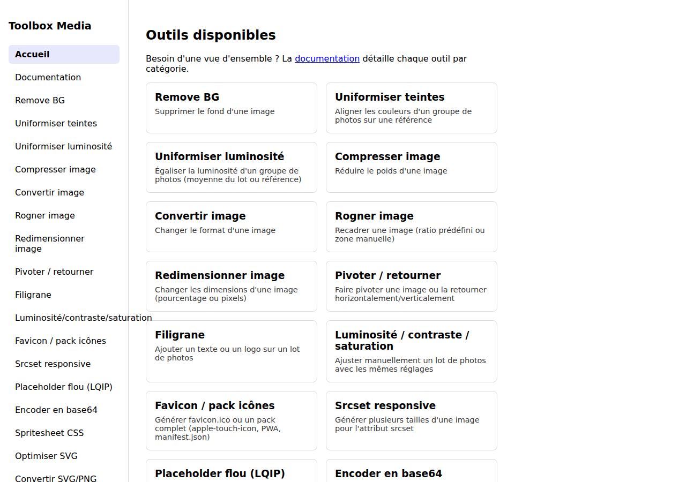
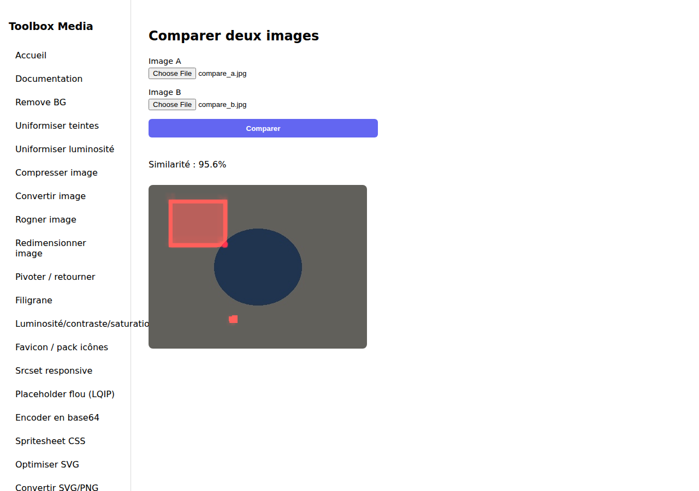
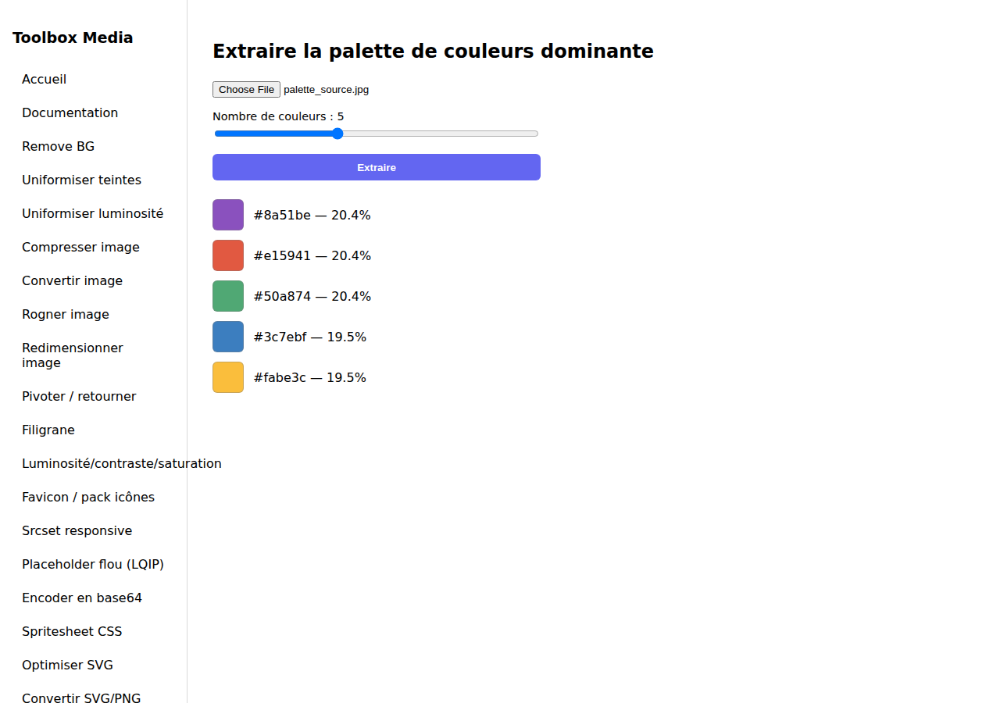
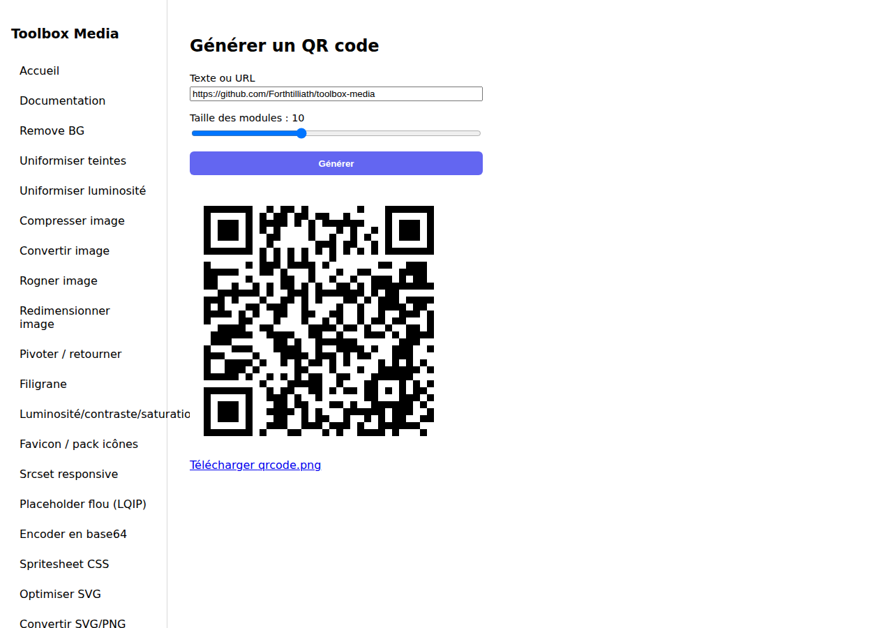
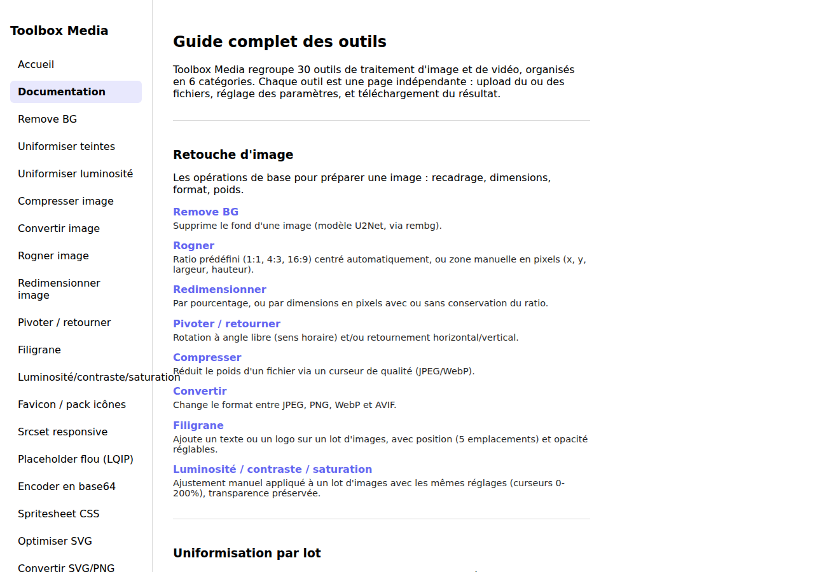

# Toolbox Media

Une boîte à outils web pour le traitement d'images et de vidéos : suppression de fond, retouche, formats pour le web, analyse et utilitaires divers — le tout auto-hébergé via Docker, sans dépendre d'un service tiers.

## Sommaire

- [Aperçu](#aperçu)
- [Fonctionnalités](#fonctionnalités)
- [Stack technique](#stack-technique)
- [Démarrage rapide](#démarrage-rapide)
- [Développement local](#développement-local-sans-docker)
- [Tests](#tests)
- [Structure du projet](#structure-du-projet)
- [API](#api)
- [Roadmap](#roadmap)
- [Licence](#licence)

## Aperçu

| Accueil | Comparer deux images |
|---|---|
|  |  |

| Palette de couleurs | QR code |
|---|---|
|  |  |

L'application embarque aussi sa propre page **Documentation** (`/documentation`), qui détaille chaque outil par catégorie avec un lien direct vers sa page :



## Fonctionnalités

Pour une présentation outil par outil directement dans l'app (avec des liens cliquables), voir la page **Documentation** accessible depuis le menu une fois l'application lancée.

### Retouche d'image

| Outil | Description |
|---|---|
| Remove BG | Suppression du fond d'une image (modèle U2Net via `rembg`) |
| Rogner | Ratio prédéfini (1:1, 4:3, 16:9) ou zone manuelle en pixels |
| Redimensionner | Par pourcentage ou dimensions, avec/sans conservation du ratio |
| Pivoter / retourner | Rotation à angle libre, flip horizontal/vertical |
| Compresser | Réduction du poids (qualité réglable) |
| Convertir | JPEG, PNG, WebP, AVIF |
| Filigrane | Texte ou logo, en lot, position et opacité réglables |
| Luminosité / contraste / saturation | Ajustement manuel en lot, préserve la transparence |

### Uniformisation par lot

| Outil | Description |
|---|---|
| Uniformiser teintes | Recale les couleurs d'un groupe de photos sur une image de référence (histogram matching) |
| Uniformiser luminosité | Aligne la luminosité (espace LAB) sur la moyenne du lot ou sur une référence, sans toucher aux teintes |

### Assets pour le développement web

| Outil | Description |
|---|---|
| Favicon / pack d'icônes | favicon.ico multi-résolution, ou pack complet (apple-touch-icon, icônes PWA 192/512, manifest.json) |
| Srcset responsive | Génère plusieurs largeurs d'une image + l'attribut `srcset` prêt à l'emploi |
| Placeholder flou (LQIP) | Mini image floutée encodée en data URI pour le lazy loading |
| Encodage base64 | Data URI d'une image pour l'inline CSS/HTML |
| Spritesheet CSS | Assemble plusieurs icônes en une image + les règles `background-position` |
| Optimiser SVG | Nettoyage et minification (`scour`) |
| Convertir SVG ↔ PNG | Rasterisation (`cairosvg`) ou encapsulation d'un PNG dans un SVG |

### Analyse d'image

| Outil | Description |
|---|---|
| Palette de couleurs | Extraction des couleurs dominantes avec pourcentages |
| Comparer deux images | Score de similarité (SSIM) + heatmap des zones qui diffèrent |

### Vidéo

| Outil | Description |
|---|---|
| Couper un extrait | Découpe entre deux timestamps |
| Vidéo → GIF | Conversion en GIF optimisé (palette dédiée) |
| Convertir | mp4, webm, mov, mkv, avi |
| Compresser | Bitrate cible et/ou largeur maximale |
| Extraire une frame | Image fixe à un instant donné |
| Concaténer | Plusieurs extraits mis bout à bout, résolution/fps normalisés automatiquement |
| Piste audio | Retrait ou remplacement de la piste audio |

### Documents & utilitaires

| Outil | Description |
|---|---|
| QR code | Génération à partir d'un texte ou d'une URL |
| Images → PDF | Assemblage de plusieurs images en un PDF multi-pages |
| PDF → images | Extraction des pages d'un PDF en PNG (résolution réglable) |
| Renommage en lot | Pattern avec `{n}`, `{name}`, `{ext}` + gestion des collisions |

La liste des prochains outils envisagés est dans [`UPGRADE.md`](./UPGRADE.md).

## Stack technique

**Backend** — Python 3.11 / [FastAPI](https://fastapi.tiangolo.com/)
- `Pillow` — traitement d'image de base (crop, resize, format, ICO/PDF...)
- `rembg` (ONNX Runtime) — suppression de fond
- `scikit-image` — histogram matching, SSIM
- `pillow-avif-plugin` — support du format AVIF
- `scour` / `cairosvg` — optimisation et rasterisation SVG
- `qrcode` / `pymupdf` — QR codes et conversion PDF
- `ffmpeg` (binaire système, appelé via `subprocess`) — tout le traitement vidéo

**Frontend** — [React 18](https://react.dev/) + [Vite](https://vitejs.dev/) + TypeScript, `react-router-dom` pour la navigation entre outils.

**Infra** — Docker Compose : le frontend est buildé en statique et servi par Nginx, qui proxifie `/api` vers le backend FastAPI (Uvicorn).

## Démarrage rapide

Prérequis : [Docker](https://docs.docker.com/get-docker/) et Docker Compose.

```bash
docker compose up -d --build
```

- Application : http://localhost:3000
- API (docs interactives Swagger) : http://localhost:8000/docs

Le premier appel à *Remove BG* télécharge le modèle U2Net (~176 Mo) ; il est ensuite mis en cache dans un volume Docker et n'est retéléchargé qu'en cas de suppression du volume.

Pour tout arrêter :

```bash
docker compose down
```

## Développement local (sans Docker)

**Backend**

```bash
cd backend
python3 -m venv .venv
source .venv/bin/activate
pip install -r requirements.txt
uvicorn app.main:app --reload --port 8000
```

Nécessite `ffmpeg` installé sur la machine (`apt install ffmpeg` / `brew install ffmpeg`).

**Frontend**

```bash
cd frontend
npm install
echo "VITE_API_BASE_URL=http://127.0.0.1:8000/api" > .env.local
npm run dev
```

L'application est alors disponible sur http://localhost:5173, branchée sur le backend local.

## Tests

**Backend** — [pytest](https://docs.pytest.org/), un test par endpoint (cas nominal + principaux cas d'erreur), exécutés directement contre l'app FastAPI via `TestClient` (pas besoin de serveur lancé) :

```bash
cd backend
source .venv/bin/activate      # ou créez-le : voir "Développement local" ci-dessus
pip install -r requirements-dev.txt
pytest -v
```

Les images/vidéos de test sont générées à la volée par les fixtures (`Pillow`, `ffmpeg`) — aucun fichier binaire dans le repo. Seul le test `test_remove_background` nécessite un accès réseau sortant : `rembg` télécharge le modèle U2Net depuis GitHub Releases au premier appel.

**Frontend** — [Vitest](https://vitest.dev/) + [Testing Library](https://testing-library.com/), avec deux volets : les appels API (`client.ts`) et un rendu de chaque page du site :

```bash
cd frontend
npm install
npm run test
```

## Structure du projet

```
toolbox-media/
├── backend/
│   ├── app/
│   │   ├── main.py                # Point d'entrée FastAPI, middlewares, routers
│   │   ├── routers/               # Un fichier par domaine (images, videos, svg, assets...)
│   │   └── services/              # Logique métier (Pillow/ffmpeg/etc.), sans dépendance FastAPI
│   ├── tests/                     # pytest, un fichier par domaine (miroir des routers)
│   ├── requirements.txt
│   ├── requirements-dev.txt       # + pytest/httpx, pour lancer les tests
│   └── Dockerfile
├── frontend/
│   ├── public/screenshots/        # Images utilisées par la page Documentation in-app
│   ├── src/
│   │   ├── api/
│   │   │   ├── client.ts          # Un appel HTTP par outil
│   │   │   └── client.test.ts     # Tests de client.ts (Vitest)
│   │   ├── components/            # Layout, panneau de résultat
│   │   ├── pages/                 # Une page par outil + Documentation.tsx
│   │   └── test/setup.ts          # Config Vitest (jest-dom)
│   └── Dockerfile
├── docs/screenshots/               # Captures d'écran utilisées par ce README
├── docker-compose.yml
└── UPGRADE.md                     # Backlog des prochains outils
```

## API

Chaque outil correspond à un endpoint `POST` qui accepte du `multipart/form-data` et renvoie soit un fichier (image, vidéo, ZIP), soit un petit JSON (`{"data_uri": "..."}` pour les outils qui retournent une donnée encodée, comme le placeholder flou).

| Préfixe | Domaine |
|---|---|
| `/api/background` | Suppression de fond |
| `/api/images` | Retouche d'image (crop, resize, watermark, etc.) |
| `/api/assets` | Assets pour le dev (favicon, srcset, spritesheet...) |
| `/api/svg` | Optimisation et conversion SVG |
| `/api/analysis` | Palette de couleurs, comparaison d'images |
| `/api/videos` | Traitement vidéo |
| `/api/misc` | QR code, PDF, renommage |

La documentation interactive complète (schémas de requête/réponse, essai en direct) est générée automatiquement par FastAPI sur `/docs` une fois le backend lancé.

## Roadmap

Les prochains outils envisagés sont listés dans [`UPGRADE.md`](./UPGRADE.md), organisés par catégorie sous forme de checklist.

## Licence

Projet personnel, pas de licence définie pour le moment.
